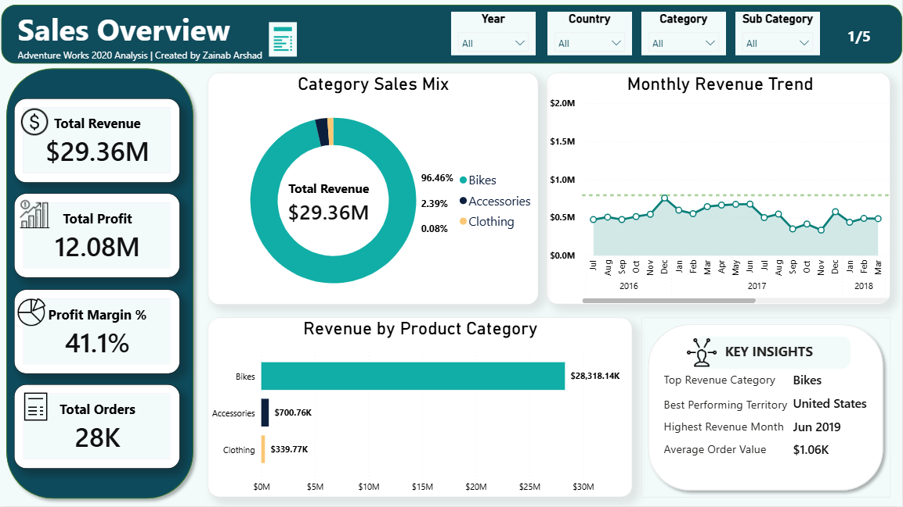
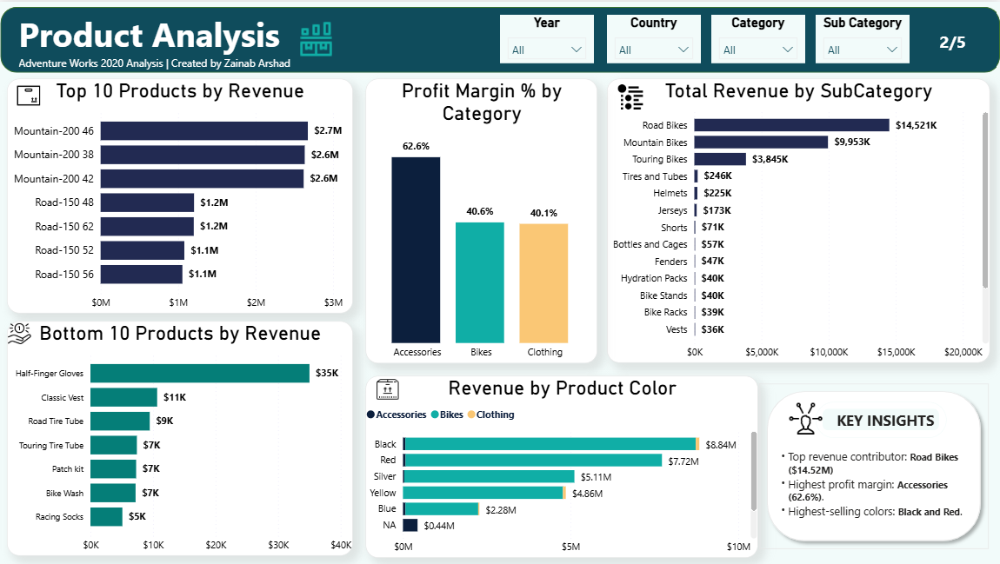
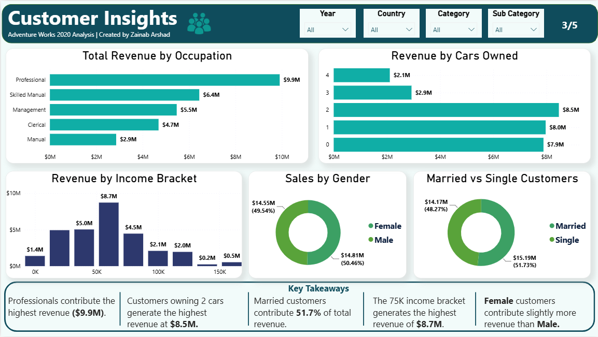
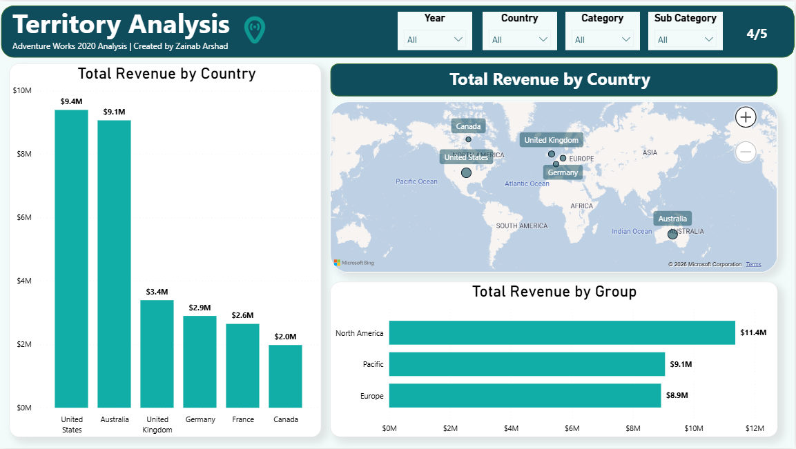
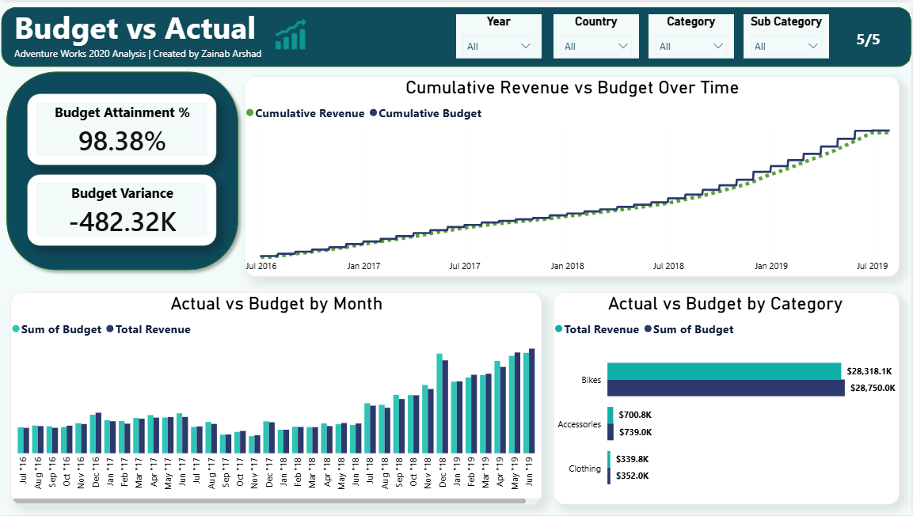

# 📊 Sales & Business Performance Dashboard
### Power BI | End-to-End Business Intelligence Project

*An interactive dashboard that transforms raw business data into actionable insights across sales, products, customers, territory, and budget performance.*

---

## 📖 Table of Contents
- [Project Overview](#-project-overview)
- [Dashboard Pages](#-dashboard-pages)
- [Tools & Skills](#️-tools--skills)
- [Preview Gallery](#-preview-gallery)
- [Key Learnings](#-key-learnings)
- [Author](#-author)

---

## 📌 Project Overview

This project turns business data into a fully interactive Power BI dashboard, giving stakeholders a single place to explore KPIs, spot trends, and drill into performance across five connected areas of the business — from top-line revenue down to individual product and territory performance.

The goal wasn't just to visualize numbers, but to build something a real sales or operations team could open and immediately answer their own questions with — no analyst required.

---

## 🗂️ Dashboard Pages

### 1️⃣ Sales Overview
A high-level command center for business health:
| Metric | Metric |
|---|---|
| Revenue | Sales Trends |
| Profit | Category Performance |
| Profit Margin | Territory Performance |
| Orders | |

### 2️⃣ Product Analysis
Product-level performance breakdown:
- Top and bottom-performing products
- Category & subcategory comparisons
- Product profitability
- Color/variant comparisons

### 3️⃣ Customer Insights
Understanding who's buying and why:
- Occupation & income
- Gender & marital status
- Cars owned (demographic segmentation)

### 4️⃣ Territory Analysis
Geographic performance comparison across regions, powered by an interactive map visual.

### 5️⃣ Budget vs Actual
Performance accountability tracking:
- Budget attainment
- Variance analysis
- Monthly actual vs. budget
- Cumulative performance over time

---

## 🛠️ Tools & Skills

`Power BI` · `DAX` · `Power Query` · `Data Modeling` · `KPI Design` · `Data Storytelling` · `Interactive Dashboard Design` · `Business Analytics`

---

## 🖼️ Preview Gallery

<table>
<tr>
<td width="50%">

**Sales Overview**

</td>
<td width="50%">

**Product Analysis**

</td>
</tr>
<tr>
<td width="50%">

**Customer Insights**

</td>
<td width="50%">

**Territory Analysis**

</td>
</tr>
<tr>
<td colspan="2">

**Budget vs Actual**

</td>
</tr>
</table>

---

## 🎯 Key Learnings

Building this project strengthened my hands-on experience in:
- 📐 KPI development & measure design
- 🔍 Interactive filtering and drill-down UX
- 📊 Data visualization best practices
- 📈 Business performance analysis
- 🎨 Dashboard layout & design
- 🧮 DAX-based analytical modeling

---

## 👩‍💻 Author

**Zainab Arshad**
*Business Data Analytics Student*

---

⭐ **If you found this project interesting, feel free to explore the dashboard and leave feedback!**

